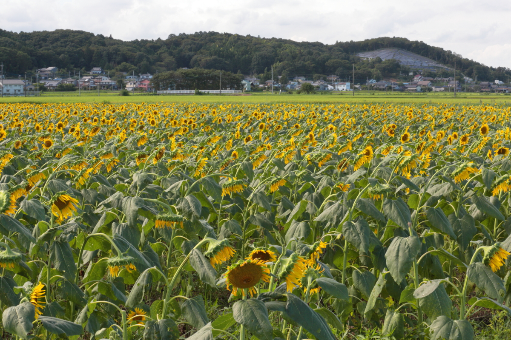

# mashiko_himawari_2

<html lang="ja">
 <head>
  <meta charset="utf-8" />
	 

<link href="https://cdnjs.cloudflare.com/ajax/libs/lightbox2/2.7.1/css/lightbox.css" rel="stylesheet">
 
</head>
<body>

  モバイル端末をお使いの場合は、画面を横向きにすると
  より見やすくご覧頂けます。

	
<h1><marquee behavior="alternate">!!! 2021年8月20日(金)栃木県芳賀郡益子町上山、ひまわり祭りにお邪魔しました !!!</marquee></h1>
                                       
	

 アクセス用QRコード

<h3>JR宇都宮駅から29kmほど南東に行ったところにある、益子ひまわり祭り会場です。</h3>

<h4>↓益子、ひまわり祭りHPへのリンク</h4>
<a href="http://www.town.mashiko.tochigi.jp/page/page003110.html" target="_blank">益子ひまわり祭り</a>  

Map

<iframe src="https://www.google.com/maps/embed?pb=!1m18!1m12!1m3!1d57797.491997464094!2d140.03297052032545!3d36.45868618953245!2m3!1f0!2f0!3f0!3m2!1i1024!2i768!4f13.1!3m3!1m2!1s0x6021fcf6baaf53b7%3A0xbef08ba7ae9da2d0!2z44Gy44G-44KP44KK56Wt5Lya5aC0!5e0!3m2!1sen!2sjp!4v1564575158565!5m2!1sen!2sjp" width="600" height="450" frameborder="0" style="border:0" allowfullscreen></iframe>

                                       

<marquee direction="left" scrollamount="5" width="85%">画面全体が夏色になりました。今年は8月23日(月)には刈り取りとのことで、残念！ (^_^)/~hada</marquee>

  

 

<!-- フッタ -->
 <footer>
 Copyright 2021/08/20 S.Hada
	 </footer>
